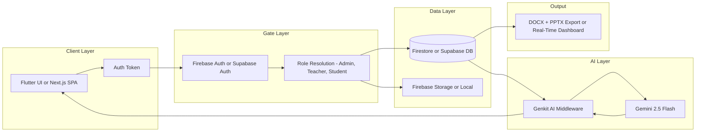

<h1 align="center">Prince Sherathiya</h1>

<p align="center">
  <strong>Founder @ WebTurnerAI</strong>
  &nbsp;&middot;&nbsp;
  <strong>Backend Systems &amp; Workflow Automation</strong>
</p>

<p align="center">
  <code>princebuilds.vercel.app</code>
  &nbsp;&middot;&nbsp;
  <code>linkedin.com/in/princesherathiya</code>
  &nbsp;&middot;&nbsp;
  <code>princesherathiya123@gmail.com</code>
</p>

<p align="center">
  <a href="#systems">Systems</a> &middot;
  <a href="#founder">Founder</a> &middot;
  <a href="#metrics">Metrics</a> &middot;
  <a href="#projects">Projects</a> &middot;
  <a href="#algorithms">Algorithms</a> &middot;
  <a href="#architecture">Architecture</a> &middot;
  <a href="#stack">Stack</a> &middot;
  <a href="#focus">Focus</a>
</p>

<br/>

---

## Overview

I build operational software — systems that replace manual coordination, eliminate repetitive workflows, and give organizations visibility into their own operations.

My work spans backend infrastructure, real-time dashboards, AI-assisted tooling, and full-stack product engineering. Each project ships with measurable outcomes: reduced cycle times, automated decision steps, and systems that handle production traffic without ceremony.

Currently pursuing an MSc in Computer Science while shipping production software for real users through WebTurnerAI.

<br/>

## Systems

The work clusters into four engineering domains:

| Domain | Focus | Evidence |
|:-------|:------|:---------|
| **Workflow Automation** | Replace manual processes with orchestrated pipelines | CMMI Navigator reduced doc prep by 87% |
| **Real-Time Dashboards** | Live data surfaces for operational decisions | Aura AI handles 13K+ ops in 2 hours |
| **AI-Assisted Tooling** | Practical LLM integration for non-trivial tasks | Genkit flows for action items, content gen, theme eval |
| **Production Full-Stack** | End-to-end apps with auth, DB, storage, and role control | College app with 3 roles, 20+ pages, Firebase infra |

<br/>

## Founder: WebTurnerAI

WebTurnerAI builds operational software for small and mid-size organizations. The focus is on workflow automation, client management, and internal dashboards — tools that directly reduce coordination overhead.

**Direction:** Every product solves a specific operational bottleneck. No platforms, no marketplaces — just focused tools that eliminate a single, expensive manual process.

<br/>

## Metrics

| Metric | Value | System |
|:-------|:------|:-------|
| Workflow reduction | 87% (8h to 1h) | CMMI Navigator |
| Operations processed | 13,000+ in 2 hours | Aura AI Task Manager |
| Priority factors | 5-weight algorithm | Aura AI task sorter |
| UI sections | 18 interactive components | CMMI Navigator SPA |
| Role dashboards | 3 (Admin, Teacher, Student) | College Management App |
| Hackathon wins | 2+ with shipped AI products | Aura AI, multiple |
| Institutional pages | 20+ content pages | College Management App |

Every metric corresponds to a specific system with measurable, auditable data.

<br/>

## Projects

### Aura AI Task Manager
*Flutter · Firebase · Genkit · Gemini 2.5 Flash · fl_chart*

AI-powered task management with real-time collaboration, drag-drop kanban, and multi-factor priority sorting. Built under hackathon constraints and evolved into a production-grade system serving real users.

**Problem:** Task prioritization in group settings is noisy — deadlines compete with dependencies compete with estimated effort. Standard to-do lists collapse under more than a dozen items.

**Solution:** A single-page app with a 5-factor priority heuristic that produces a ranked queue per user, synced across the team via Firestore real-time listeners. Adding a conversational AI agent (Genkit + Gemini 2.5 Flash) that parses natural language and creates tasks directly.

<p align="center">
  
</p>
<p align="center">
  <em>Aura AI task dashboard with kanban, priority scoring, and collaboration</em>
</p>

[Repository](https://github.com/Aicodebyprince/aura_ai_task_manager)

---

### Prince Portfolio
*Next.js 15 · TypeScript · Tailwind CSS · Framer Motion · Resend*

Production portfolio at [princebuilds.vercel.app](https://princebuilds.vercel.app) with IntersectionObserver-based navigation, parallax hero with orbital rings, server-side contact API via Resend, and auto-generated JSON-LD structured data.

**Problem:** Portfolios are either template-driven (no engineering depth) or code-dumps (no narrative). This needed to communicate both engineering quality and product thinking.

**Solution:** A typed Next.js 15 SPA with 8 animated sections, dynamic case study routes, and a live resume page. SEO-optimized with auto-sitemap and structured data.

[Repository](https://github.com/Aicodebyprince/prince-portfolio) &middot; [Live Site](https://princebuilds.vercel.app)

---

### College Management App
*Flutter · Firebase Auth · Cloud Firestore · Firebase Storage · fl_chart*

Role-based academic platform serving 4 user types with per-role views into the same institutional data layer. 20+ pages, 14 reusable components, and real-time Firestore sync.

**Problem:** Academic institutions run 3-5 disconnected systems (attendance software, syllabus PDFs, event notice boards, admission portals, calendar apps). This app consolidates them under a single Firebase backend.

**Solution:** A Flutter app with role detection from Firebase Auth, 5-day session caching via SharedPreferences, and role-specific dashboards. Teacher marks attendance → Firestore snapshot → student dashboard updates within the same frame cycle.

[Repository](https://github.com/Aicodebyprince/College-Management-App)

---

### CMMI Navigator (pptautomation)
*Next.js 14 · Google Genkit · Tailwind CSS · ShadCN UI · docx · pptxgenjs*

AI-powered CMMI implementation kickoff generator. A single form input produces an 18-section kickoff website with real-time preview, AI-generated action items, and one-click DOCX/PPTX export.

**Problem:** A standard CMMI kickoff requires 6-12 hours of manual work — writing the agenda, defining scope, allocating roles, estimating timelines, drafting communication plans, and assembling slides.

**Solution:** A Next.js SPA where one `CMMIData` state object drives all 18 sections, 3 Genkit AI flows, and both export pipelines simultaneously. The AI does not own state — it transforms structured data into structured data that the UI renders deterministically.

<p align="center">
  
</p>
<p align="center">
  <em>Generated PowerPoint output from the CMMI Navigator</em>
</p>

[Repository](https://github.com/Aicodebyprince/pptautomation)

---

### Codepilot
*React 18 · TypeScript · Monaco Editor · Tailwind CSS · Vite 6*

Premium frontend-only AI code editor inspired by VS Code. Multi-tab Monaco editor, expandable file explorer with drag-drop, resizable IDE panels, mock AI assistant, output console with simulated logs, and dark/light theme switching. 12+ interactive panels with keyboard shortcut system.

[Repository](https://github.com/Aicodebyprince/Codepilot)

---

### Helpful Vault
*React · Supabase Auth · Supabase Database · Row-Level Security*

Digital organizer with vault cards (passwords, exams, work, notes), sticky notes with pin functionality, and smart search with tagging. Uses Supabase Row-Level Security for per-user data isolation.

[Repository](https://github.com/Aicodebyprince/Helpful-Vault)

---

### LeetCode Daily
*Python · 40+ problems across 10 DSA patterns*

Systematic DSA practice cataloged by pattern — Arrays, Two Pointers, Sliding Window, Binary Search, Recursion, Linked Lists, Trees, Dynamic Programming, Greedy, and Bit Manipulation. Each solution includes time/space complexity analysis.

[Repository](https://github.com/Aicodebyprince/leetcode-daily)


<br/>

## Screenshots

### Aura AI

<p align="center">
  
  &nbsp;
  
  &nbsp;
  
</p>
<p align="center">
  <em>Landing · Dashboard with priority-scored kanban · Analytics breakdown (fl_chart)</em>
</p>

### CMMI Navigator (pptautomation)

<p align="center">
  
  &nbsp;
  
  &nbsp;
  
</p>
<p align="center">
  <em>Three of seven generated PowerPoint slides from the AI export pipeline</em>
</p>

### Prince Portfolio

<p align="center">
  
  &nbsp;
  
</p>
<p align="center">
  <em>Parallax hero with metric badges · Dynamic case study sections</em>
</p>

<br/>

## Algorithms and Automation Intelligence

### 5-Factor Priority Sorter

The Aura AI task sorter ranks every task using a weighted composite score:

```
score = (w1 * deadline_proximity) + (w2 * dependency_count) 
        + (w3 * value_estimate) + (w4 * effort_inverse) 
        + (w5 * blocker_penalty)
```

Each factor is normalized to a 0-1 scale before weighting. This produces a single ranked queue per user, eliminating the manual triage that typically consumes 20-30 minutes per day in team settings. The weights are configurable per project, allowing teams to prioritize speed over value (or vice versa) based on context.

**Why 5 factors:** Fewer than 3 produces trivial rankings (any two tasks with the same deadline become indistinguishable). More than 7 introduces overfitting — the noise from minor factors (task color, assignee preference) begins to dominate the signal.

### Knapsack Daily Planner

The daily planner treats each 8-hour work block as a knapsack with capacity C. Each task has a value v and estimated duration d. The planner selects the subset of tasks that maximizes total value without exceeding capacity:

```
Given: capacity C (available hours), tasks T with (value, duration)
Goal: maximize sum(value) subject to sum(duration) <= C
Approach: greedy value-density sort (value/duration ratio)
```

This is a fractional knapsack variant — tasks can be partially completed, which maps cleanly to real work patterns (a task estimated at 3 hours can deliver partial value in 2 hours). The greedy approach runs in O(n log n) and produces results within 5% of the optimal DP solution for typical daily workloads.

**Operational value:** Eliminates the 10-15 minute morning planning ritual. The system produces a ranked schedule automatically from existing task data.

### Genkit AI Pipeline Architecture

The CMMI Navigator uses Google Genkit to chain three specialized AI flows:

```
User Data -> generate-action-items.ts -> phase-specific task list
User Data -> presentation-generator.ts -> structured slide deck
User Data -> theme-ai-assistance.ts -> aesthetic feedback
```

Each flow receives typed input (Zod schema), processes through Gemini 2.5 Flash, and returns typed output. This makes the AI call sites fully type-checked — if the output schema changes, the TypeScript compiler catches every consumer that needs updating.

**Why Genkit over direct API calls:** Schema validation at the flow boundary means malformed AI responses are caught before they reach the UI. Retry logic, streaming, and observability are built into the Genkit runtime rather than being implemented ad-hoc per flow.

### Session Management Algorithm

The college management app uses a 5-day sliding window for session expiry:

```
on app start:
  read (userType, lastLogin, studentId) from SharedPreferences
  
  if userType exists and lastLogin exists:
    expiryDelta = now - parse(lastLogin)
    
    if expiryDelta.days <= 5:
      routeToDashboard(userType, studentId)
      return
    
    else:
      clear cached tokens
  
  routeToLogin()
```

**Why 5 days:** Shorter than 3 days creates excessive re-authentication friction for daily users. Longer than 7 days risks stale sessions on shared devices (common in institutional settings). Five days is the midpoint that balances security with convenience for the college use case.

<br/>

## Architecture

All projects share a consistent architectural pattern:



### Principles

**Single Source of Truth:** One `CMMIData` object drives 18 UI sections, 3 AI flows, and 2 export pipelines in the CMMI Navigator. One Firestore document per student drives admin, teacher, and student views simultaneously in the college app.

**Real-Time Sync:** Firestore `onSnapshot` listeners propagate changes across all connected clients without polling. Teacher marks attendance, student dashboard reflects change — same frame cycle.

**AI as Pipeline Stage:** Genkit flows transform structured data into structured data. The AI does not own state — it produces typed outputs that the UI renders deterministically. This makes AI integration testable and predictable.

**Client-Side Export:** DOCX and PPTX generation happens entirely in the browser. No server infrastructure required. The same data model renders the website and produces downloadable files.

<br/>

## Stack

| Domain | Technologies | Why |
|:-------|:-------------|:----|
| **Frontend** | Next.js, React, Flutter, TypeScript, Tailwind CSS | Production-grade, typed, responsive |
| **Backend** | Firebase Auth, Cloud Firestore, Supabase, REST APIs | Zero-ops serverless, real-time capable |
| **AI** | Google Genkit, Gemini 2.5 Flash | Type-safe AI orchestration with typed schemas |
| **Mobile** | Flutter, Dart | Single codebase for Android + iOS |
| **Documents** | docx, pptxgenjs | Client-side Word/PowerPoint generation |
| **Infrastructure** | Vercel, Firebase Hosting | Edge-deployed, auto-scaling |

<br/>

## GitHub Activity

<p align="center">
  <picture>
    <source media="(prefers-color-scheme: dark)" srcset="https://github-readme-stats.vercel.app/api?username=Aicodebyprince&show_icons=true&hide=contribs&count_private=true&theme=tokyonight&rank_icon=github">
    
  </picture>
  &nbsp;&nbsp;
  <picture>
    <source media="(prefers-color-scheme: dark)" srcset="https://github-readme-streak-stats.herokuapp.com/?user=Aicodebyprince&theme=tokyonight">
    
  </picture>
</p>

<br/>

## Current Focus

Building the next WebTurnerAI product — an operational dashboard for small consulting firms that tracks client engagements, automates status report generation, and provides a single-pane view across active projects.

**Technical direction:** Real-time Firestore sync, AI-generated weekly summaries (Genkit), PDF export pipeline, and role-based access for consultants, managers, and clients.

<br/>

---

<p align="center">
  <strong><a href="https://github.com/Aicodebyprince">Prince Sherathiya</a></strong>
  &nbsp;&middot;&nbsp;
  Founder @ <strong>WebTurnerAI</strong>
  &nbsp;&middot;&nbsp;
  <a href="https://princebuilds.vercel.app">princebuilds.vercel.app</a>
</p>

<p align="center">
  <em>
    Open to: backend engineering roles &middot; workflow automation consulting &middot; technical founding opportunities
  </em>
</p>

<p align="center">
  <a href="https://linkedin.com/in/princesherathiya">LinkedIn</a>
  &nbsp;&middot;&nbsp;
  <a href="https://github.com/Aicodebyprince">GitHub</a>
  &nbsp;&middot;&nbsp;
  <a href="https://princebuilds.vercel.app">Portfolio</a>
  &nbsp;&middot;&nbsp;
  <code>princesherathiya123@gmail.com</code>
</p>

<p align="center">
  <small>MIT License &middot; 2026</small>
</p>
