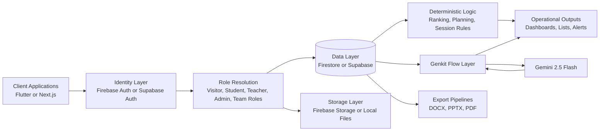

# Prince Sherathiya

<p align="center">
  <strong>Founder @ WebTurnerAI</strong>
  &nbsp;&middot;&nbsp;
  <strong>Backend Systems Engineer</strong>
  &nbsp;&middot;&nbsp;
  <strong>Workflow Automation Builder</strong>
</p>

<p align="center">
  <a href="https://princebuilds.vercel.app">Portfolio</a>
  &nbsp;&middot;&nbsp;
  <a href="https://linkedin.com/in/princesherathiya">LinkedIn</a>
  &nbsp;&middot;&nbsp;
  <a href="mailto:princesherathiya123@gmail.com">Email</a>
</p>

<p align="center">
  <a href="#executive-snapshot">Snapshot</a> &middot;
  <a href="#live-product-preview">Preview</a> &middot;
  <a href="#overview">Overview</a> &middot;
  <a href="#operating-philosophy">Philosophy</a> &middot;
  <a href="#engineering-focus">Engineering Focus</a> &middot;
  <a href="#founder-webturnerai">Founder</a> &middot;
  <a href="#impact-metrics">Impact</a> &middot;
  <a href="#featured-systems">Systems</a> &middot;
  <a href="#architecture-and-systems-thinking">Architecture</a> &middot;
  <a href="#automation-and-algorithm-intelligence">Algorithms</a> &middot;
  <a href="#engineering-stack">Stack</a> &middot;
  <a href="#current-focus">Focus</a>
</p>

---

## Executive Snapshot

| Perspective | What You See Here |
|:--|:--|
| **For Recruiters** | Production-ready backend/full-stack systems, role-based architecture, measurable workflow impact |
| **For Founders** | Execution-first product thinking, operational bottleneck solving, fast shipping with technical depth |
| **For Clients** | Practical automation systems that reduce coordination overhead and improve reporting visibility |

## Live Product Preview

<p align="center">
  
  
  
</p>
<p align="center"><em>Real-time dashboard views from shipped operational systems</em></p>

## Overview

I build operational software that removes manual coordination from day-to-day execution.

My work sits at the intersection of backend systems, workflow automation, AI-assisted tooling, and full-stack product delivery. I prioritize software that produces measurable operational gains: faster cycle times, fewer manual handoffs, and clearer decision visibility.

I am currently pursuing an MSc in Computer Science while shipping production software through **WebTurnerAI**.

## Operating Philosophy

I approach products as operating systems for real teams.

1. Start from an expensive manual workflow, not from a feature list.
2. Design state and permissions before UI details.
3. Keep deterministic logic for critical execution paths.
4. Use AI as a bounded transformation layer, not as source of truth.
5. Measure improvements with practical operational metrics.

This approach keeps systems reliable, explainable, and useful under production constraints.

## Engineering Focus

| Domain | What I Build | Typical Outcome |
|:--|:--|:--|
| **Backend Systems** | Auth models, role resolution, data access boundaries, API-connected logic | Reliable operational behavior under multi-role usage |
| **Workflow Automation** | Structured workflow engines, doc/export pipelines, action-generation flows | Reduced manual preparation and coordination overhead |
| **Operational Dashboards** | Real-time views for teams, managers, and admins | Faster decisions and clearer execution state |
| **AI-Assisted Tooling** | Genkit-based flows, typed schemas, controlled model integration | Practical AI gains without pipeline fragility |
| **Full-Stack Product Engineering** | End-to-end systems from UX to deployment | Production-ready systems with direct business value |

## Founder: WebTurnerAI

WebTurnerAI is my operating vehicle for building execution-focused software.

### What it stands for

- Systems over noise.
- Workflow clarity over feature bloat.
- Shipping value over speculative architecture.

### Product direction

WebTurnerAI focuses on software for organizations that need:

1. Better internal workflow orchestration.
2. Visibility across active operations.
3. Faster turnaround on repetitive process-heavy work.

## Impact Metrics

These are direct system-level outcomes from active projects.

| Metric | Value | System |
|:--|:--|:--|
| Workflow compression | 8h to 1h (87% reduction) | CMMI Navigator |
| Execution volume | 13,000+ operations in 2 hours | Aura AI Task Manager |
| Priority model depth | 5-factor weighted sorter | Aura AI Task Manager |
| Unified presentation architecture | 18 sections driven by one state model | CMMI Navigator |
| Role-based operation modes | Visitor, Student, Teacher, Admin | College Management App |
| Institutional content coverage | 20+ pages | College Management App |
| Algorithm consistency discipline | 40 consecutive days | LeetCode Daily |

All metrics are tied to named repositories and implementation artifacts.

## Featured Systems

### 1) Aura AI Task Manager

**Stack:** TypeScript, Next.js, Firebase, Genkit, Gemini 2.5 Flash, Framer Motion, fl_chart

**Operational problem**

Team prioritization usually degrades into manual triage. Deadlines, dependencies, effort, and value compete in unstructured ways.

**Engineering implementation**

Aura AI uses a two-layer intelligence model:

1. Deterministic ranking and planning engine.
2. Generative AI assistant for natural-language task ingestion and support.

**Why it matters**

This architecture preserves execution reliability while still providing flexible AI interaction.

**Recruiter signal**

Demonstrates algorithm design, real-time state handling, and production-grade product UX.

**Founder signal**

Shows ability to convert a coordination problem into a scalable execution system.

**Links**

- Repository: <https://github.com/Aicodebyprince/aura_ai_task_manager>

---

### 2) CMMI Navigator (`pptautomation`)

**Stack:** TypeScript, Next.js, Genkit, Tailwind CSS, ShadCN UI, docx, pptxgenjs

**Operational problem**

CMMI kickoff preparation is traditionally manual, repetitive, and time-expensive.

**Engineering implementation**

One typed `CMMIData` model drives:

1. 18 interactive sections.
2. 3 AI orchestration flows.
3. Browser-side DOCX/PPTX export pipelines.

**Why it matters**

A single source of truth keeps UI, AI outputs, and exported artifacts synchronized.

**Recruiter signal**

Strong state modeling, typed AI pipeline integration, and practical automation architecture.

**Founder signal**

Directly converts consulting effort into reusable productized workflow infrastructure.

**Links**

- Repository: <https://github.com/Aicodebyprince/pptautomation>

---

### 3) College Management App

**Stack:** Flutter, Dart, Firebase Auth, Cloud Firestore, Firebase Storage, SharedPreferences, fl_chart

**Operational problem**

Academic workflows are usually fragmented across separate systems for attendance, syllabus, events, and institutional content.

**Engineering implementation**

Unified role-based platform with:

1. Auth-driven role routing.
2. Real-time data sync across user types.
3. Session lifecycle logic with controlled expiry.

**Why it matters**

It centralizes institutional operations while preserving role-specific views and access boundaries.

**Recruiter signal**

Proof of role-based system design, mobile product execution, and real-time backend integration.

**Founder signal**

Demonstrates ability to unify fragmented operations under one maintainable software surface.

**Links**

- Repository: <https://github.com/Aicodebyprince/College-Management-App>

---

### 4) Prince Portfolio

**Stack:** Next.js 15, TypeScript, Tailwind CSS, Framer Motion, Resend

**Operational problem**

Most portfolio surfaces either look polished but shallow, or deep but unreadable.

**Engineering implementation**

Narrative-driven site architecture with:

1. Typed section and routing system.
2. Motion system for hierarchy and flow.
3. API-backed contact workflow and SEO structure.

**Why it matters**

It communicates founder positioning and engineering depth with product-level UX quality.

**Recruiter signal**

Clear communication architecture plus strong modern frontend implementation quality.

**Founder signal**

Shows product storytelling discipline and brand-to-technical coherence.

**Links**

- Repository: <https://github.com/Aicodebyprince/prince-portfolio>
- Live: <https://princebuilds.vercel.app>

---

### 5) Codepilot

**Stack:** React 18, TypeScript, Vite 6, Monaco Editor, Tailwind CSS

**Operational problem**

Complex interface behavior in editor-like products requires strong state architecture to stay usable.

**Engineering implementation**

IDE-style UI with tab management, explorer behaviors, resizable panels, and keyboard interaction system.

**Why it matters**

Demonstrates product-level interaction engineering and composable frontend systems thinking.

**Recruiter signal**

Strong evidence of advanced UI state management and interaction-system architecture.

**Founder signal**

Ability to build polished high-complexity interfaces with clear product direction.

**Links**

- Repository: <https://github.com/Aicodebyprince/Codepilot>

---

### 6) Helpful Vault

**Stack:** React, Supabase Auth, Supabase Database, Row-Level Security

**Operational problem**

Users need a secure and searchable system for fragmented personal operational data.

**Engineering implementation**

Vault cards, sticky notes, and categorized retrieval backed by auth-aware row-level access boundaries.

**Why it matters**

Shows practical access-control implementation and secure CRUD product architecture.

**Recruiter signal**

Demonstrates secure data design using auth and row-level access controls.

**Founder signal**

Builds trust-centered utility software with clear everyday operational value.

**Links**

- Repository: <https://github.com/Aicodebyprince/Helpful-Vault>

---

### 7) LeetCode Daily

**Stack:** Python, pattern-based DSA practice

**Operational problem**

Interview prep and algorithm development often fail without consistency and documented reasoning.

**Engineering implementation**

40-day structured pattern progression with explicit complexity analysis.

**Why it matters**

Signals repeatable problem decomposition and algorithmic discipline.

**Recruiter signal**

Consistent complexity-aware coding discipline over a fixed timeline.

**Founder signal**

Reflects execution consistency and systems-thinking mindset under daily constraints.

**Links**

- Repository: <https://github.com/Aicodebyprince/leetcode-daily>

## Screenshot Showcase

### Aura AI Task Manager

<p align="center">
  
  
  
</p>
<p align="center"><em>Landing, operations dashboard, and analytics views</em></p>

### CMMI Navigator

<p align="center">
  
  
  
</p>
<p align="center"><em>Generated deck artifacts from AI-assisted kickoff workflow</em></p>

### Prince Portfolio

<p align="center">
  
  
</p>
<p align="center"><em>Founder narrative and project storytelling surface</em></p>

If you are scanning quickly: the top **Live Product Preview** section is the primary visual summary.

## Architecture and Systems Thinking

Across projects, I use a consistent operational architecture pattern.



### Architectural Principles

1. **Single Source of Truth:** shared canonical model for UI, workflow logic, and exports.
2. **Role-Aware Boundaries:** access control is enforced from auth to data consumption.
3. **Real-Time Propagation:** event and state updates push directly to active clients.
4. **Deterministic Core:** critical planning logic remains algorithmic and testable.
5. **AI as Bounded Layer:** AI transforms structured data, but does not own system state.
6. **Output Symmetry:** the same data powers dashboards and exported artifacts.

### Engineering Tradeoff Patterns

| Decision | Tradeoff | Why Chosen |
|:--|:--|:--|
| Serverless backend (Firebase/Supabase) | Less low-level infra control | High iteration speed for product workflows |
| Browser-side document generation | Heavy client operations on complex exports | Removes server bottlenecks for content export |
| Deterministic scoring + AI assistant | Increased architecture complexity | Preserves reliability while enabling flexible interaction |
| Role-specific dashboards over one generic dashboard | More UI surface area | Better clarity and lower cognitive load per user type |

## Automation and Algorithm Intelligence

### 1) 5-Factor Task Priority Sorter

```text
score = (w1 * deadline_proximity)
      + (w2 * dependency_count)
      + (w3 * value_estimate)
      + (w4 * effort_inverse)
      + (w5 * blocker_penalty)
```

**Why it exists:** manual prioritization does not scale under high task volume.

**Operational value:** creates a deterministic execution queue per user/team context.

### 2) Knapsack-Inspired Daily Planner

```text
Given:
  capacity C (available hours)
  tasks T with value v and duration d

Goal:
  maximize total value with sum(d) <= C

Approach:
  sort by value density (v / d) and allocate greedily
```

**Why it exists:** daily planning overhead compounds across teams.

**Operational value:** compresses planning into an automated ranked schedule.

### 3) Typed Genkit Orchestration Flows

```text
User Data -> generate-action-items.ts -> phase action plan
User Data -> presentation-generator.ts -> structured slide content
User Data -> theme-ai-assistance.ts -> design guidance
```

**Why it exists:** untyped model outputs increase integration fragility.

**Operational value:** schema-governed outputs improve reliability and maintainability.

### 4) Session Lifecycle Windowing (College App)

```text
on app launch:
  read cached identity data
  if session_age_days <= 5:
    route to role dashboard
  else:
    clear session and route to login
```

**Why it exists:** institutional users need low friction with controlled session expiry.

**Operational value:** practical balance between usability and access hygiene.

## Engineering Stack

| Layer | Technologies | Why This Layer Matters |
|:--|:--|:--|
| **Frontend** | Next.js, React, Flutter, TypeScript, Tailwind CSS | Fast product iteration with typed, maintainable UI systems |
| **Backend Services** | Firebase Auth, Firestore, Supabase, REST APIs | Low-ops infrastructure with real-time capability |
| **AI Orchestration** | Google Genkit, Gemini 2.5 Flash | Structured AI integration with typed flow boundaries |
| **Mobile** | Flutter, Dart | Single codebase for cross-platform product delivery |
| **Automation Outputs** | docx, pptxgenjs | Business-ready artifacts generated from runtime data |
| **Hosting and Delivery** | Vercel, Firebase Hosting | Reliable deployment and production iteration speed |

## GitHub Analytics

<p align="center">
  <picture>
    <source media="(prefers-color-scheme: dark)" srcset="https://github-readme-stats.vercel.app/api?username=Aicodebyprince&show_icons=true&hide=contribs&count_private=true&theme=tokyonight&rank_icon=github">
    
  </picture>
  <picture>
    <source media="(prefers-color-scheme: dark)" srcset="https://github-readme-streak-stats.herokuapp.com/?user=Aicodebyprince&theme=tokyonight">
    
  </picture>
</p>

## Current Focus

I am currently building the next WebTurnerAI operational platform for consulting teams:

1. Client engagement tracking from a single operational dashboard.
2. Automated status report generation from live execution data.
3. AI-assisted weekly summaries for manager/client visibility.
4. Role-based access for consultants, managers, and clients.
5. Export-ready outputs for reporting and stakeholder communication.

## Collaboration

I am open to:

- Backend engineering roles.
- Workflow automation consulting.
- Product engineering partnerships.
- Technical founder collaborations.

---

<p align="center">
  <strong><a href="https://github.com/Aicodebyprince">Prince Sherathiya</a></strong>
  &nbsp;&middot;&nbsp;
  Founder @ <strong>WebTurnerAI</strong>
  &nbsp;&middot;&nbsp;
  <a href="https://princebuilds.vercel.app">Portfolio</a>
  &nbsp;&middot;&nbsp;
  <a href="https://linkedin.com/in/princesherathiya">LinkedIn</a>
  &nbsp;&middot;&nbsp;
  <a href="mailto:princesherathiya123@gmail.com">Email</a>
</p>
