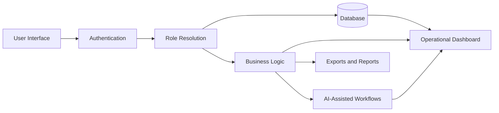

# Prince Sherathiya

  <strong>Software Engineer</strong>
  &nbsp;&middot;&nbsp;
  <strong>Backend-Focused Developer</strong>
  &nbsp;&middot;&nbsp;
  <strong>Production Systems & Workflow Automation</strong>

  <a href="https://princesherathiya.vercel.app">Portfolio</a>
  &nbsp;&middot;&nbsp;
  <a href="https://linkedin.com/in/princesherathiya">LinkedIn</a>
  &nbsp;&middot;&nbsp;
  <a href="mailto:princesherathiya123@gmail.com">Email</a>

  
  
  

  <a href="#snapshot">Snapshot</a> &middot;
  <a href="#engineering-focus">Engineering Focus</a> &middot;
  <a href="#featured-projects">Featured Projects</a> &middot;
  <a href="#architecture-and-systems-thinking">Architecture</a> &middot;
  <a href="#technical-stack">Stack</a> &middot;
  <a href="#current-focus">Current Focus</a>

---

## Snapshot

I build practical software systems that improve visibility, automate repetitive workflows, and solve real operational problems.

My work is focused on backend-oriented product development, role-based applications, dashboards, workflow automation, data-driven systems, and production-ready web applications. I care about software that is reliable, maintainable, easy to use, and useful under real business constraints.

I am currently pursuing an **M.Sc. in Computer Science** at **Mithibai College**, while continuing to build full-stack and backend-focused projects that strengthen my software engineering skills.

| Area | What I Focus On |
|:--|:--|
| **Software Engineering** | Building maintainable applications with clear data models, reliable workflows, and production-ready UX |
| **Backend Development** | APIs, authentication, role-based access, databases, serverless backends, and business logic |
| **Workflow Automation** | Tools that reduce manual work, improve reporting visibility, and simplify operational processes |
| **Engineering Growth** | Java, Spring Boot, Data Structures & Algorithms, System Design, PostgreSQL, and cloud deployment |

## Engineering Focus

| Domain | What I Build | Engineering Signal |
|:--|:--|:--|
| **Backend Systems** | Auth flows, role resolution, data access boundaries, API-connected logic | Reliable behavior across different user roles and workflows |
| **Dashboards & Internal Tools** | Operational dashboards, reporting interfaces, status tracking, performance views | Practical product engineering for real teams and business workflows |
| **Workflow Automation** | Document generation, status reporting, task planning, process automation | Reduced manual work with structured, repeatable software flows |
| **AI-Assisted Tooling** | Controlled AI workflows, structured prompts, typed outputs, productivity assistants | Practical AI integration without making AI the source of truth |
| **Full-Stack Development** | Frontend, backend, database, deployment, documentation, and testing workflows | End-to-end ownership from idea to usable software |

## Live Product Preview

  
  
  

<em>Dashboard, analytics, and team views from project work focused on workflow visibility and execution.</em>

## Featured Projects

### 1) Aura AI Task Manager

**Stack:** TypeScript, Next.js, Firebase, Genkit, Gemini, Framer Motion

Aura AI Task Manager is an AI-assisted productivity and workflow management system built to help users plan, prioritize, and manage tasks with better visibility.

**Engineering highlights**

- Built a real-time dashboard experience for task, analytics, and group-level visibility.
- Combined deterministic task logic with AI-assisted workflows.
- Designed the system around practical productivity flows instead of generic AI chat.
- Implemented a polished UI with modern frontend architecture and reusable sections.

**Why it matters**

This project demonstrates full-stack product thinking, real-time state handling, AI integration, dashboard design, and practical workflow automation.

**Links**

- Repository: <https://github.com/Aicodebyprince/aura_ai_task_manager>

---

### 2) CMMI Navigator / PPT Automation

**Stack:** TypeScript, Next.js, Genkit, Tailwind CSS, ShadCN UI, docx, pptxgenjs

CMMI Navigator is an automation system for generating structured consulting and kickoff artifacts from organized project data.

**Engineering highlights**

- Built a multi-section workflow powered by a shared data model.
- Implemented AI-assisted generation flows for structured business outputs.
- Added document and presentation generation using browser-side export pipelines.
- Focused on reducing repetitive manual preparation work.

**Why it matters**

This project demonstrates state modeling, document automation, AI-assisted workflow design, and product engineering for business process improvement.

**Links**

- Repository: <https://github.com/Aicodebyprince/pptautomation>

---

### 3) College Management App

**Stack:** Flutter, Dart, Firebase Auth, Cloud Firestore, Firebase Storage, SharedPreferences

College Management App is a role-based mobile application for managing academic and institutional workflows.

**Engineering highlights**

- Implemented role-based user flows for students, teachers, admins, and visitors.
- Integrated Firebase Authentication and Cloud Firestore for backend services.
- Added institutional content, attendance-related flows, syllabus handling, and dashboard views.
- Used session lifecycle logic to balance usability and access control.

**Why it matters**

This project demonstrates role-based system design, mobile application development, real-time backend integration, and practical academic workflow management.

**Links**

- Repository: <https://github.com/Aicodebyprince/College-Management-App>

---

### 4) Helpful Vault

**Stack:** React, Supabase Auth, Supabase Database, Row-Level Security

Helpful Vault is a secure personal data utility designed for storing and retrieving organized notes, cards, and useful information.

**Engineering highlights**

- Built authenticated CRUD flows.
- Used Supabase Auth and database-backed storage.
- Applied row-level security concepts for user-specific data boundaries.
- Designed the product around searchable, categorized personal information.

**Why it matters**

This project demonstrates secure data handling, authentication-aware design, database-backed UI flows, and practical full-stack application development.

**Links**

- Repository: <https://github.com/Aicodebyprince/Helpful-Vault>

---

### 5) Codepilot

**Stack:** React, TypeScript, Vite, Monaco Editor, Tailwind CSS

Codepilot is an IDE-style frontend interface focused on editor interactions, layout behavior, and developer-tool UI patterns.

**Engineering highlights**

- Built an editor-style interface with Monaco Editor.
- Worked on tab management, panels, explorer behavior, and keyboard-style interactions.
- Practiced complex frontend state handling and component composition.

**Why it matters**

This project demonstrates frontend systems thinking, interaction design, complex UI state management, and developer-tool product architecture.

**Links**

- Repository: <https://github.com/Aicodebyprince/Codepilot>

---

### 6) Prince Portfolio

**Stack:** Next.js, TypeScript, Tailwind CSS, Framer Motion, Resend

My portfolio is designed to present my software engineering work, experience, education, hackathons, and production projects in a recruiter-focused way.

**Engineering highlights**

- Built a modern portfolio with structured project and experience pages.
- Added deep-dive pages for selected work and internships.
- Improved SEO, routing, responsiveness, and content architecture.
- Used the portfolio as a central source for professional storytelling.

**Links**

- Live: <https://princesherathiya.vercel.app>

---

### 7) LeetCode Daily

**Stack:** Python, DSA practice, complexity analysis

LeetCode Daily is a structured repository for algorithm practice and interview preparation.

**Engineering highlights**

- Organized solutions by problem-solving patterns.
- Practiced complexity analysis and consistent problem decomposition.
- Used the repository to build discipline in Data Structures & Algorithms.

**Links**

- Repository: <https://github.com/Aicodebyprince/leetcode-daily>

## Internship & Production Experience

Some of my strongest engineering experience comes from internal company tools built during my internship work at **UNIVIA Management International**.

Because these tools involve company workflows and internal data, the source code and production systems are not public. I still document the work professionally through my portfolio and resume while respecting confidentiality.

**Relevant internal work includes:**

- Client engagement tracking and operational visibility tools.
- Process improvement applications for tracking, reporting, and workflow coordination.
- Dashboard-driven systems for improving visibility across clients, teams, and internal processes.
- Automation-focused applications built around real business requirements.

This experience strengthened my ability to understand requirements, model data, design workflows, build production interfaces, and communicate software value to non-technical stakeholders.

## Architecture and Systems Thinking

Across projects, I try to follow a consistent engineering approach:

### Principles I try to follow

1. **Model the workflow before building screens.**
2. **Keep authentication, roles, and data boundaries clear.**
3. **Use deterministic logic for critical business rules.**
4. **Use AI as a support layer, not as the system of record.**
5. **Build dashboards that help users make faster decisions.**
6. **Document projects so another developer can understand and run them.**

## Technical Stack

| Layer | Technologies |
|:--|:--|
| **Languages** | Java, JavaScript, TypeScript, Python, Dart |
| **Frontend** | React, Next.js, Tailwind CSS, ShadCN UI, Framer Motion |
| **Backend & APIs** | Node.js, REST APIs, Firebase, Supabase |
| **Databases** | PostgreSQL, SQL, Cloud Firestore, Supabase Database |
| **Mobile** | Flutter, Dart |
| **AI Integration** | Genkit, Gemini-based workflows |
| **Tools** | Git, GitHub, Vercel, Firebase Hosting, VS Code |
| **Currently Strengthening** | Spring Boot, System Design, DSA, Cloud Computing, Backend Architecture |

## Engineering Profile

I use GitHub as a public engineering portfolio: not only to show code, but to show how I think about systems, workflows, documentation, tradeoffs, and maintainability.

| What I Show | How I Show It |
|:--|:--|
| **Production thinking** | Projects built around real workflows, dashboards, automation, and user roles |
| **Backend fundamentals** | Authentication, databases, APIs, access boundaries, and business logic |
| **System design mindset** | Architecture notes, workflow modeling, role-based behavior, and data flow diagrams |
| **Professional documentation** | README files with purpose, features, setup, screenshots, and engineering decisions |
| **Interview preparation** | DSA practice, complexity analysis, Java/Spring Boot learning, and backend-focused projects |

## Repository Quality Checklist

I continuously improve my repositories around the standards expected from production-oriented software engineering work:

- Clear README files with project purpose, features, tech stack, and setup steps.
- Screenshots, demos, or workflow previews where available.
- Meaningful folder structure and naming.
- Architecture notes for larger or more complex projects.
- Authentication, database, and role-handling notes where relevant.
- Setup instructions that help another developer run or understand the project.
- Incremental improvements through version control instead of one-time uploads.

## Current Focus

I am currently focused on becoming a stronger Software Engineer by improving in:

- Java and Spring Boot backend development.
- Data Structures & Algorithms for technical interviews.
- PostgreSQL, database design, and API development.
- System design and scalable application architecture.
- Production-quality documentation, testing, deployment, and maintainability.
- Building practical projects that demonstrate real engineering ability.

## Open To

- Software Engineering internships and entry-level roles.
- Backend and full-stack development opportunities.
- Java / Spring Boot / API-focused projects.
- Production web application development.
- Workflow automation and internal tool engineering.

---

  <strong><a href="https://github.com/Aicodebyprince">Prince Sherathiya</a></strong>
  &nbsp;&middot;&nbsp;
  <a href="https://princesherathiya.vercel.app">Portfolio</a>
  &nbsp;&middot;&nbsp;
  <a href="https://linkedin.com/in/princesherathiya">LinkedIn</a>
  &nbsp;&middot;&nbsp;
  <a href="mailto:princesherathiya123@gmail.com">Email</a>

